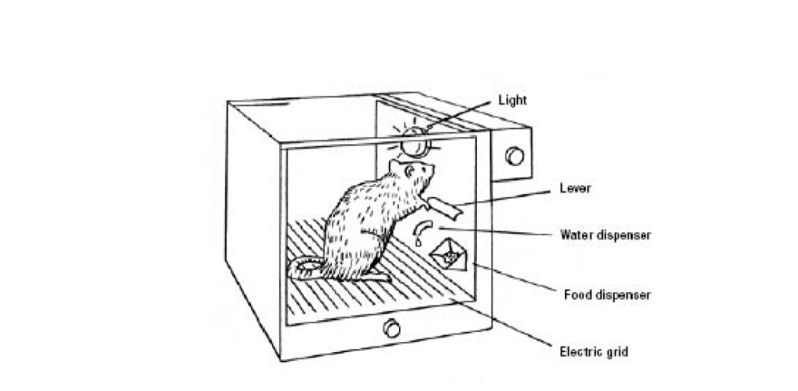

# Skinnerbox

> A dead simple forkable NFT vending machine

# Usage

Here's an example walkthrough of how it's used:

You can try it out here: https://factoria-org.github.io/skinnerbox

# How to use

1. Go deploy an NFT contract with [Factoria](https://factoria.app/)
2. Fork this repository
3. Update the [box.json](box.json) to set your own contract address from step 1
4. (optional) Customize style by changing the [style.css](style.css)
5. Create github pages ([tutorial](https://dev.to/byteslash/getting-started-with-github-pages-4jpf))

# Advanced

For those of you who want to hack on it to build custom features. Here are the relevant files:

1. [index.html](index.html): This is the main landing page, which displays the currently signed in user's invite lists
2. [mint.html](mint.html): This is the minting app

The code is super simple because it's powered by **[f0.js](f0.js)**, which abstracts away most of the web3, ipfs, and merkle proof handling into one liner methods.
